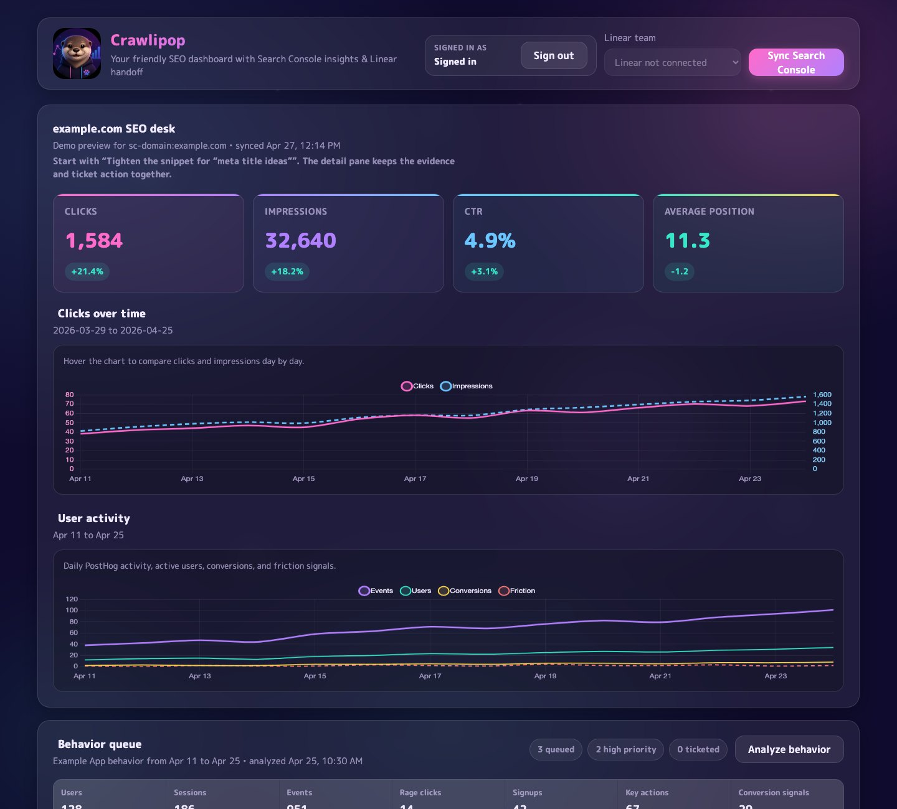
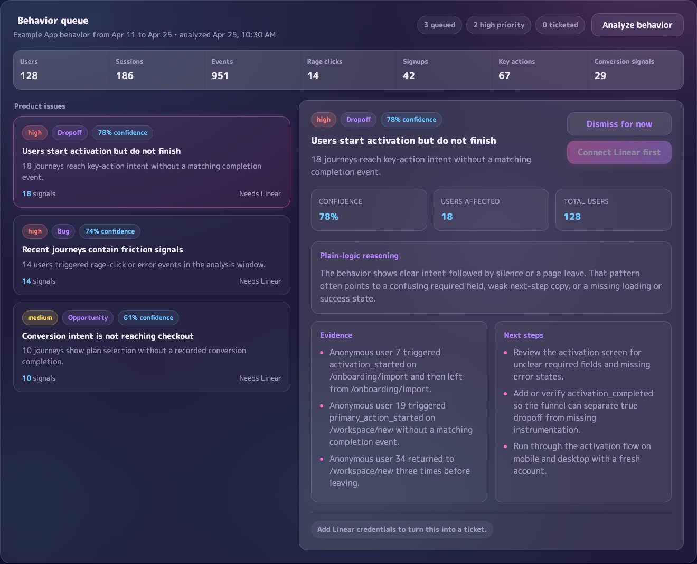
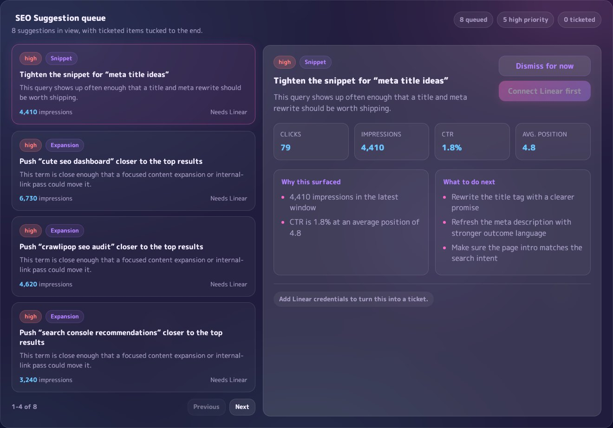
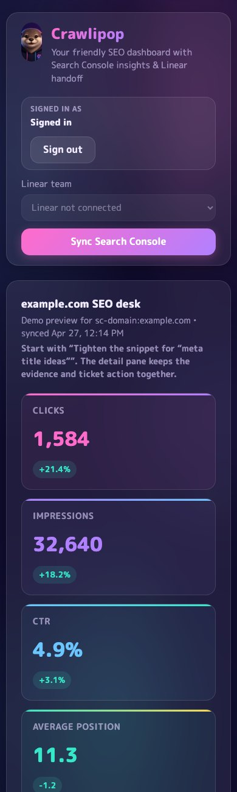

# Crawlipop

A small SEO ops dashboard for Google Search Console and PostHog that:

- shows Search Console performance at a glance,
- turns recent query/page changes into recommendations,
- analyzes product behavior from PostHog,
- lets you create a Linear issue directly from a suggestion.

The app ships with demo Google Search Console and PostHog-style behavior data so the interface is usable before you connect any external services.

## Screenshots









## Run it

```bash
cp .env.example .env
npm install
npm start
```

Open `http://localhost:3000`.

## Tests

```bash
npm run check
npm test
npm run test:e2e
npm run test:all
```

The Node test suite covers auth helpers, configuration, local storage, recommendation generation, behavior analysis, and PostHog normalization. The Playwright suite starts the real app in demo mode and verifies the dashboard, suggestion dismissal, sync flow, and public demo API responses.

## Environment

```env
PORT=3000
DATA_DIR=.data
PRODUCT_NAME=your product
GOOGLE_CLIENT_ID=
GOOGLE_CLIENT_SECRET=
AUTH_SESSION_SECRET=
AUTH_ALLOWED_EMAILS=you@example.com
GOOGLE_SITE_URL=sc-domain:example.com
GOOGLE_SERVICE_ACCOUNT_JSON=
GOOGLE_SERVICE_ACCOUNT_KEY_FILE=
GOOGLE_DATA_DELAY_DAYS=2
SYNC_SCHEDULE=17 */6 * * *
LINEAR_API_KEY=
LINEAR_DEFAULT_TEAM_ID=
POSTHOG_HOST=https://us.posthog.com
POSTHOG_PROJECT_ID=
POSTHOG_PERSONAL_API_KEY=
POSTHOG_LOOKBACK_DAYS=30
POSTHOG_ANALYSIS_MAX_AGE_HOURS=24
POSTHOG_EXCLUDED_DISTINCT_IDS=
POSTHOG_EXCLUDED_EMAILS=
```

Recommended setup:

- Create a Google OAuth web app for sign-in and set `GOOGLE_CLIENT_ID`, `GOOGLE_CLIENT_SECRET`, and `AUTH_ALLOWED_EMAILS`.
- `AUTH_SESSION_SECRET` falls back to `ppk` outside production, but set an explicit random value for any real deployment.
- Put your Google service account JSON in a local file and set `GOOGLE_SERVICE_ACCOUNT_KEY_FILE`.
- Use `GOOGLE_SITE_URL=sc-domain:example.com` for domain properties or the full URL for URL-prefix properties.
- Set `PRODUCT_NAME` to label behavior analysis for your app or product.
- Set `LINEAR_DEFAULT_TEAM_ID` if you want one-click issue creation without choosing a team in the UI.

For Google auth, register these callback URLs in your OAuth client:

- `http://localhost:3000/api/auth/google/callback`
- your deployed callback URL, for example `https://your-app.up.railway.app/api/auth/google/callback`

## Search Console setup

1. Create a Google Cloud service account and download its JSON key.
2. Add that service account email to the Search Console property with access to the property.
3. Fill in `GOOGLE_SITE_URL` plus either `GOOGLE_SERVICE_ACCOUNT_KEY_FILE` or `GOOGLE_SERVICE_ACCOUNT_JSON`.
4. Start the app, choose a Data window if you want something other than 28 days, and click `Sync Search Console`.

The server queries two rolling windows, compares them, and generates recommendations from:

- high-impression / low-CTR queries,
- near-page-one queries,
- pages losing clicks while still ranking well,
- pages with strong momentum worth expanding.

The dashboard supports 7, 14, 28, 60, and 90 day data windows. Search Console syncs and PostHog behavior analysis both use the selected window. SEO suggestions are also checked against the latest 7 days of the selected window so fixes made during a longer window do not keep showing as active work after the recent data has recovered.

## Linear setup

1. Create a Linear personal API key.
2. Set `LINEAR_API_KEY`.
3. Optionally set `LINEAR_DEFAULT_TEAM_ID`, or choose a team from the dropdown in the UI.

When you click a suggestion, Crawlipop creates a Linear issue with a prefilled title, metrics, evidence, and next steps.

## PostHog behavior setup

1. Create a PostHog personal API key with project query access.
2. Set `POSTHOG_HOST`, `POSTHOG_PROJECT_ID`, and `POSTHOG_PERSONAL_API_KEY`.
3. Add your own PostHog distinct IDs or email addresses to `POSTHOG_EXCLUDED_DISTINCT_IDS` / `POSTHOG_EXCLUDED_EMAILS` so Crawlipop filters out internal behavior.

When the dashboard opens, Crawlipop silently refreshes the product behavior analysis if the cached result is stale. Manual behavior analysis uses the selected Data window, and the default cache age is 24 hours.

The behavior queue is tuned for this generic funnel:

- account signup,
- activation or key product action,
- paid conversion or checkout.

It uses these explicit events when available:

- `account_signup_started`, `account_signup_completed`,
- `activation_started`, `activation_completed`,
- `conversion_started`, `conversion_completed`,
- `checkout_completed`, `checkout_error`, `conversion_error`.

Until all of those are instrumented, Crawlipop falls back to common events such as `sign_up`, `primary_action_started`, `primary_action_completed`, `pricing_plan_selected`, `checkout_started`, `$rageclick`, `$pageview`, and `$pageleave`. Missing funnel events can surface as instrumentation suggestions.

Behavior suggestions use confidence percentages, can be dismissed independently from SEO suggestions, and can create Linear tickets with prefixes such as `[Bug]`, `[UX]`, `[Growth]`, or `[Instrumentation]`.

## Notes

- The app is locked behind Google auth and an `AUTH_ALLOWED_EMAILS` allowlist when those auth variables are configured.
- Search Console data is delayed by default with `GOOGLE_DATA_DELAY_DAYS=2` to avoid partial fresh-day data.
- The app caches the latest dashboard payload in `DATA_DIR/dashboard-cache.json` and defaults to `.data/dashboard-cache.json` locally.
- If Search Console sync fails after a prior successful sync, the last cached snapshot is kept and the error is shown in the UI.

## Deploy on Railway

The repo includes a `railway.json` with:

- `npm start` as the start command,
- `/health` as the healthcheck path,
- Railpack as the builder.

Recommended Railway variables:

```env
DATA_DIR=/data
PRODUCT_NAME=your product
GOOGLE_CLIENT_ID=...
GOOGLE_CLIENT_SECRET=...
AUTH_SESSION_SECRET=...
AUTH_ALLOWED_EMAILS=you@example.com
GOOGLE_SITE_URL=sc-domain:example.com
GOOGLE_SERVICE_ACCOUNT_JSON={...service-account-json...}
GOOGLE_DATA_DELAY_DAYS=2
SYNC_SCHEDULE=17 */6 * * *
LINEAR_API_KEY=
LINEAR_DEFAULT_TEAM_ID=
POSTHOG_HOST=https://us.posthog.com
POSTHOG_PROJECT_ID=...
POSTHOG_PERSONAL_API_KEY=...
POSTHOG_LOOKBACK_DAYS=30
POSTHOG_ANALYSIS_MAX_AGE_HOURS=24
POSTHOG_EXCLUDED_DISTINCT_IDS=
POSTHOG_EXCLUDED_EMAILS=
```

Notes:

- Railway injects `PORT`; do not hardcode it.
- Register `https://your-app.up.railway.app/api/auth/google/callback` in the same Google OAuth client you use for local development.
- Set an explicit `AUTH_SESSION_SECRET` in Railway; the `ppk` fallback is only for non-production environments.
- Use `GOOGLE_SERVICE_ACCOUNT_JSON` on Railway rather than `GOOGLE_SERVICE_ACCOUNT_KEY_FILE`.
- Without a mounted volume, the dashboard cache is ephemeral and will reset on redeploy/restart.

## Security

Do not commit `.env`, service account JSON files, PostHog exports, Linear API keys, or generated dashboard caches. See `SECURITY.md` for private vulnerability reporting guidance.

## License

MIT

## References

- Google Search Console Search Analytics API: https://developers.google.com/webmaster-tools/v1/searchanalytics/query
- Google Search Console authorization: https://developers.google.com/webmaster-tools/v1/how-tos/authorizing
- Search Console owners, users, and permissions: https://support.google.com/webmasters/answer/7687615
- Linear developer SDK: https://linear.app/developers/sdk
- Linear GraphQL API usage: https://linear.app/developers/oauth-actors#making-api-requests-on-behalf-of-the-user
